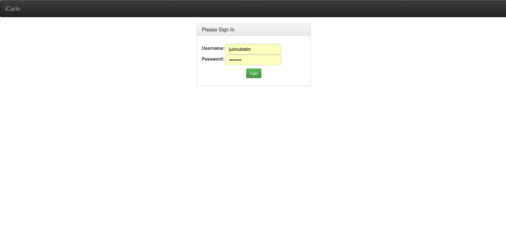
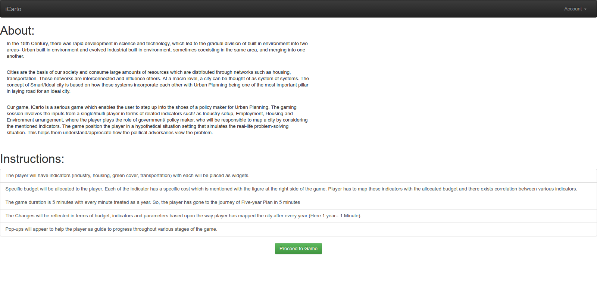
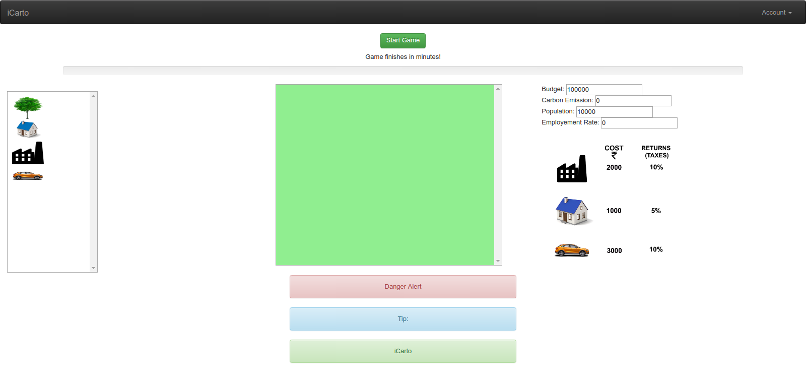
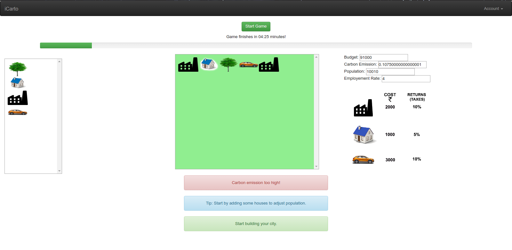

This is a project for Juincubator Hackathon. 
Run the project by instsalling latest Python Django.  
Command to run the project: 
python manage.py runserver 8080 

<h1> Login Page </h1>
<<<<<<< HEAD

=======

  

<h1> About the Game </h1>

<h1> Game at start </h1>

<h1> During Gameplay </h1>

>>>>>>> 4ae0570b841db7f3e3251c35d981757b62b73630
